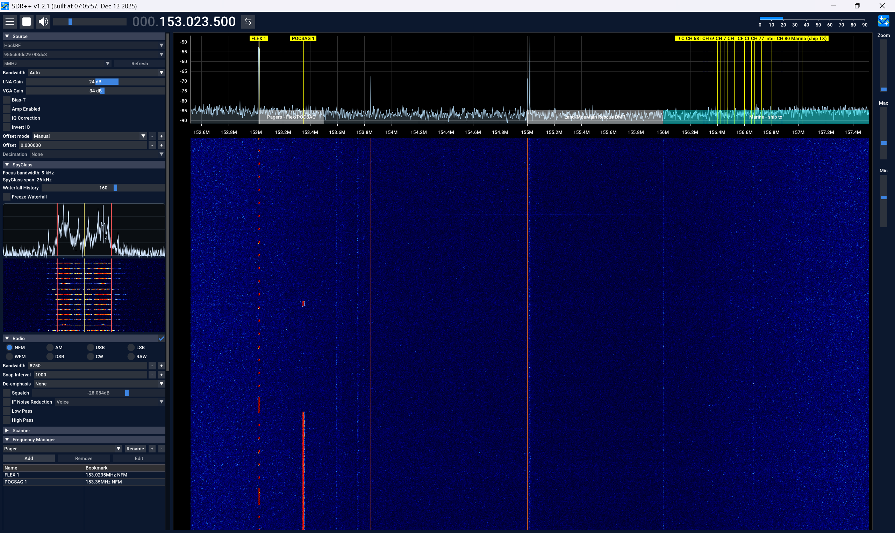
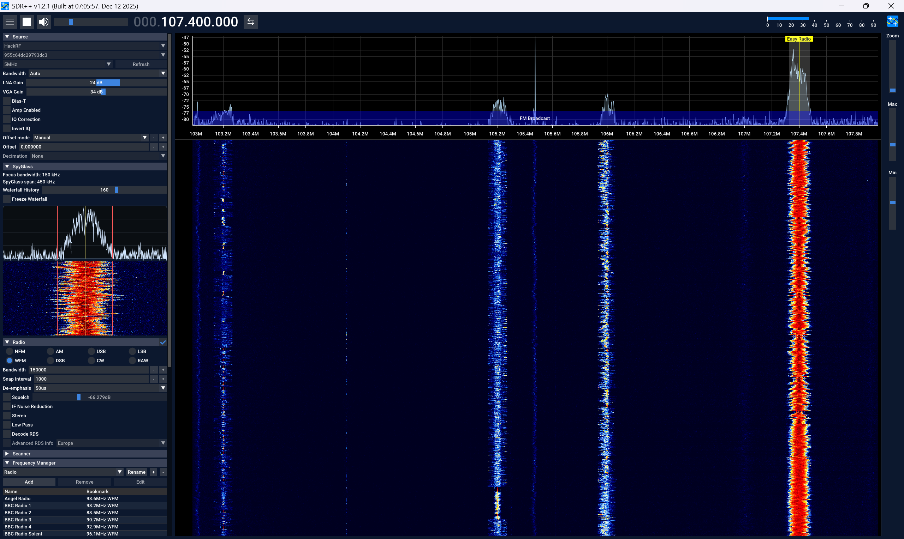

# SpyGlass

`SpyGlass` is an SDR++ plugin that adds a focused side-panel spectrum and waterfall to SDR++.

## Screenshots

FLEX / narrow digital example:



FM broadcast example:



## Features

Current behavior:

- Tracks the active SDR++ VFO, with `Radio` as the default fallback.
- Uses an independent hidden tap VFO and its own FFT pipeline, so it does not depend on the main waterfall zoom.
- Sets SpyGlass span to `3 x` the tracked VFO bandwidth.
- Draws focus-bandwidth edge markers and a center marker on both the spectrum and waterfall.
- Mirrors the main SDR++ display color map and scale behavior.
- Keeps waterfall history aligned across retunes using per-row frequency mapping.
- Left-clicking the SpyGlass spectrum or waterfall retunes the tracked VFO.

## Install

Copy `spyglass.dll` into your SDR++ `modules` folder and restart SDR++.

Typical Windows example:

- `sdrpp_windows_x64\modules\spyglass.dll`

## Build

This project is currently built against an SDR++ source checkout for headers while linking against the installed SDR++ runtime on Windows.

At a high level, the build process is:

```powershell
1. Generate import libraries for the SDR++ runtime DLLs you are targeting
2. Build `spyglass.dll` against the matching SDR++ source tree
3. Copy the resulting DLL into your SDR++ `modules` folder
```

Expected result:

- `spyglass.dll`

## Notes

- This version is currently targeted at Windows SDR++ builds similar to the development environment used for the initial plugin work.
- The repo includes local shim headers for `fftw3` and `volk` because many SDR++ Windows packages are runtime-only.
- Compatibility with other SDR++ builds is not guaranteed without rebuilding against a matching version.
